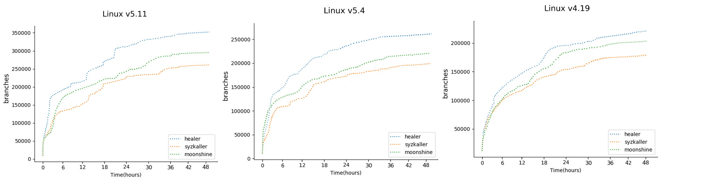

# Supplementary Experiments

We list the supplementary experiments in this directory. 
We monitor the fuzzing process of Linux kernel versions 5.11, 5.4 and 4.19 while comparing its performance to those of Syzkaller and Moonshine. We sample each fuzzer’s performance statistics each minute in the 48-hour. 
This directory contains the result of 48h coverage comparision experiment.

## Coverage Comparison Experiment in 48 hours

## HEALER + Moonshine Seed

